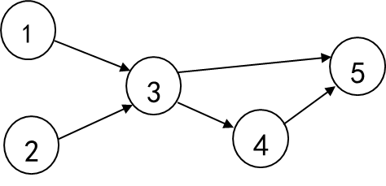
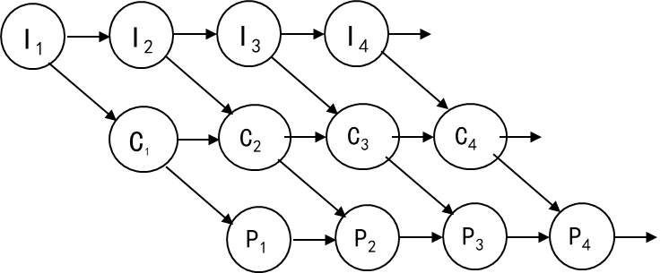
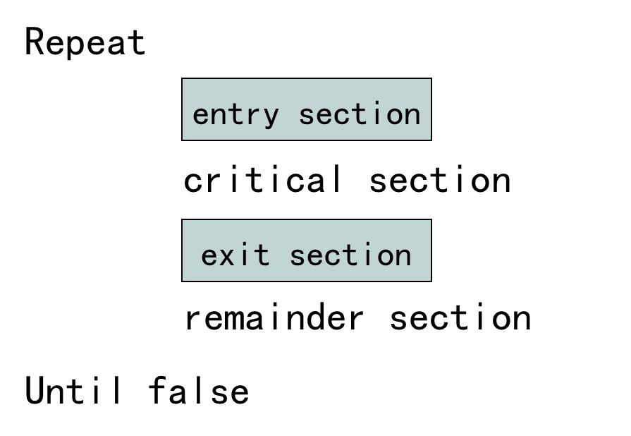
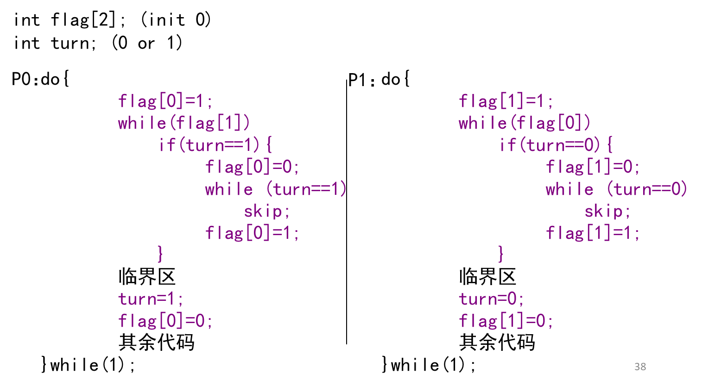
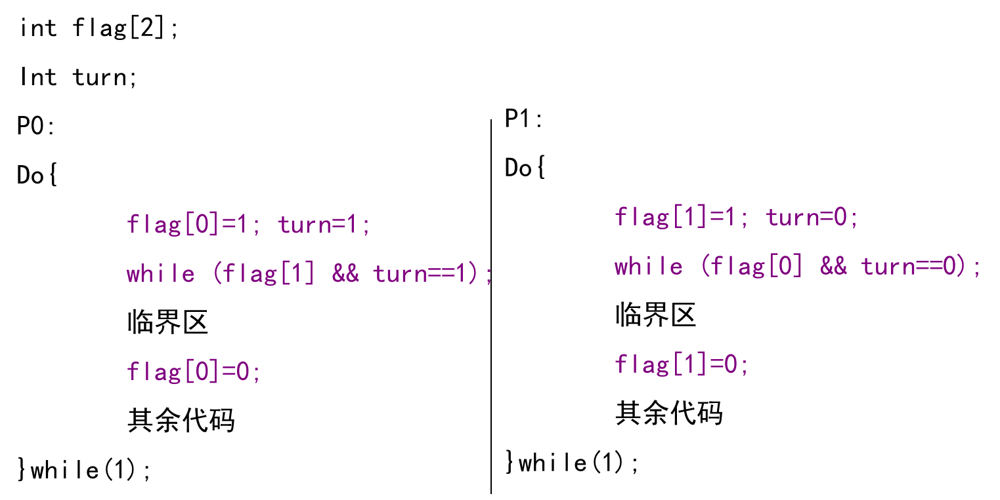
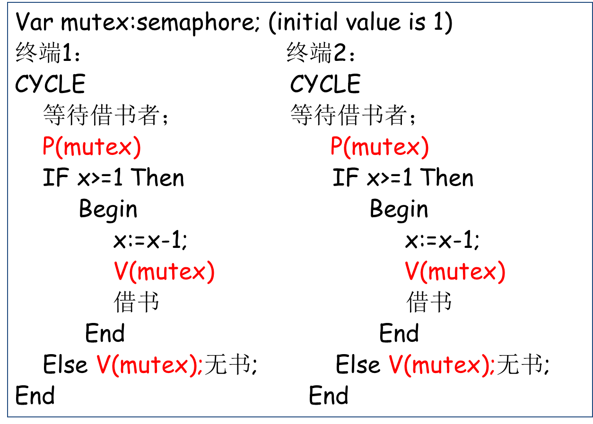
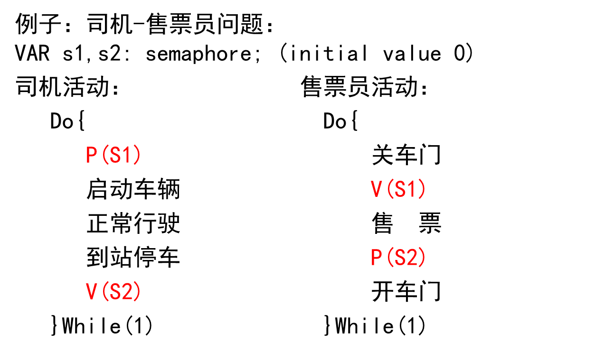
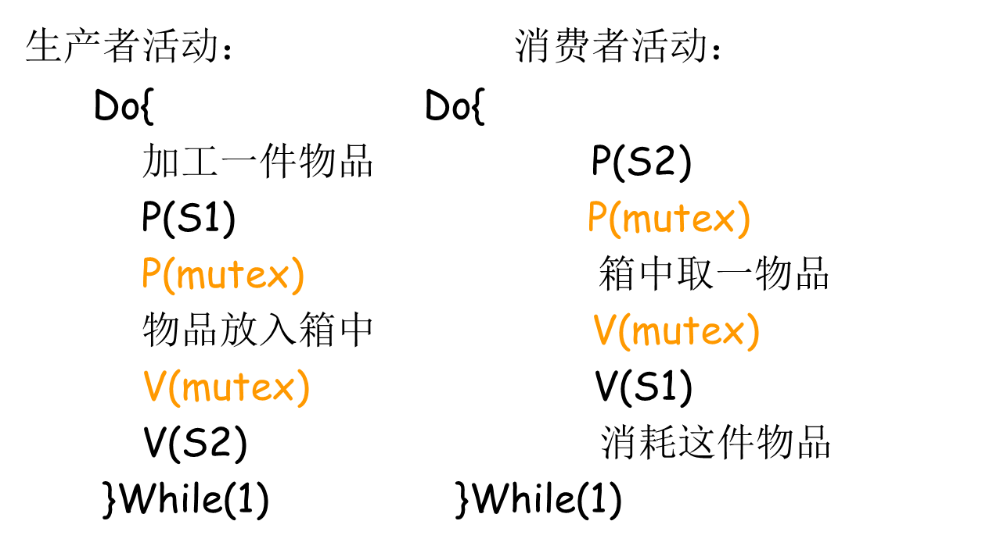
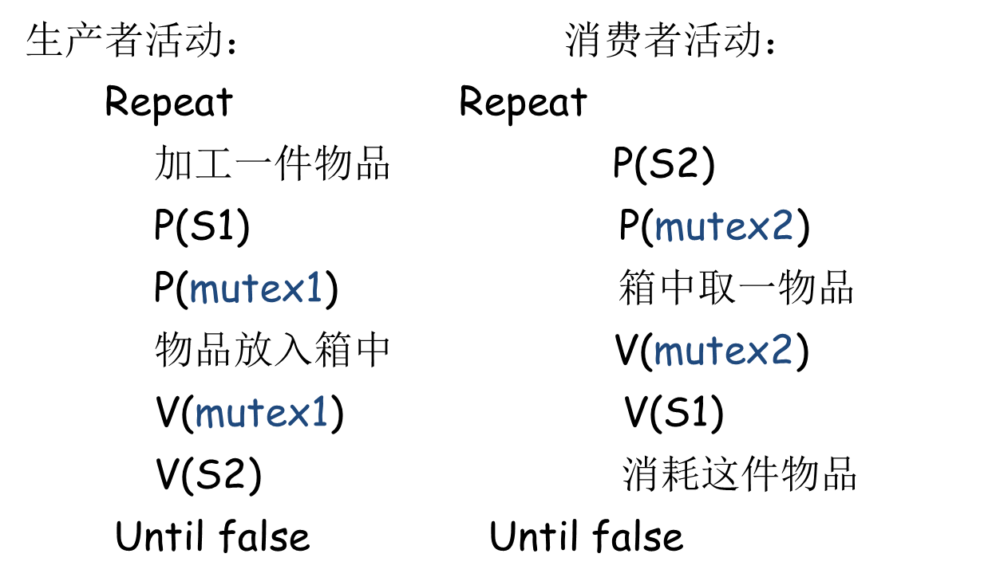

[TOC]

# 互斥同步与通讯

## 并发进程

### 前驱图

- 有向无环图，图中每个结点表示一个语句、一个计算步骤、或一个进程
- 结点间的有向边表示偏序或前趋(precedence relation)关系
- 在前趋图中，没有前趋的结点称为初始结点，没有后继的结点称为终止结点
- 每个结点可以有一个权重(weight)，它可以表示该结点所包含的程序量或计算时间
- 类似于图论里的AOE网

### 顺序程序

- 程序顺序执行

  > 1. 内部顺序性：对于一个进程来说，它的所有指令是按序执行的
  >
  >    
  >
  > 2. 外部顺序性：对于多个进程来说，所有进程的活动是依次执行的
  >
  >    输入(I)、计算(C)、打印(P)三个活动构成的进程
  >
  >    

- 顺序程序特性：连续，封闭，可再现

### 并发程序

- 程序并发执行

  > 1. 内部并发性：一个程序的并发性
  >
  >    
  >
  > 2. 外部并发性：多个程序之间的并发性，之间的交叉点由中断引起
  >
  >    

- 特性：间断，非封闭，不可再现

- 并发程序的表示:

  > `cobegin S1; S2; …; Sn coend;`
  >
  > `parbegin S1; S2; …; Sn parend;`


### 程序并发执行的条件

- 在失去封闭性的条件下，保持**可再现性**。

  > `R(pi)={a1,a2,…,am}`表示程序pi在执行期间所需读取的所有变量的集合，称为**“读集”**
  >
  > `W(pi)={b1,b2,…,bn}`表示程序pi在执行期间所需改变的所有变量的集合，称为**“写集”**

- 若两个程序p1，p2满足如下条件，则能够保持可再现性，因而可以并发执行。称为**Bernstein条件**。

  > [!note]
  >
  > ***R(p1)∩W(p2)∪R(p2)∩W(p1)∪W(p1)∩W(p2)=Φ***

### 与时间有关的错误

1. 同步写

   > [!warning]
   >
   > 程序并发交叉过程中改变了变量的运行环境，会导致错误。

2. 关于就绪队列的整队问题

   > 
   >
   > 结论:该错误因**共享就绪队列**引起,对就绪队列操作不当,也是与时间相关的错误导致结果不唯一.

3. 两进程申请两个独占性资源

   > 

> [!note]
>
> 错误原因之1：    进程执行交叉(interleave);
>
> 错误原因之2：    涉及公共变量(x)。
>
> Remarks:
>
> - 某些交叉结果不正确;
> - 必须去掉导致不正确结果的交叉。

## 进程互斥

### 共享变量与临界区

> [!note]
>
> 共享变量(shared variable)：多个进程都需要访问的变量
>
> 临界区域(critical region)：**访问共享变量的程序段**；访问同一组共享变量的临界区不能并发

- 表示

  > 共享变量: `shared <一组变量>`
  >
  > 临界区域: `region <一组变量> do <语句＞`

### 临界区域与进程互斥

- 定义：多个进程**不能同时**进入关于**同一组共享变量的临界区域**，否则可能发生与时间有关的错误，这种现象称为**进程互斥**。

> [!important]
>
>  （1）任何时刻最多只能有一个进程处于同一组共享变量的**相同**的临界区域
>
>   （2）任何时刻最多只能有一个进程处于同一组共享变量的**不同**的临界区域
>
> ​    Remarks: 互斥是相对于**公共变量**而言的

---

### 进程互斥的实现

- **Framework**

  > 

- **Requirements**:

  > mutual exclusion(互斥性): 一次只允许一个进程进入关于同一组公共变量的临界区
  >
  > Progress(进展性): 临界区空闲时，放行一个进入者
  >
  > bounded waiting(有限等待): 一个想要进入临界区的进程在等待有限个进程进入并离开临界区后获得进入临界区的机会

- 临界资源：一次只允许一个进程使用的资源

  > 当关于某一组共享变量的临界区**均为空**时，一个要求进入该组公共变量的某一临界区的进程应当能够立刻进入；
  >
  > 当关于某一组共享变量的某一临界区被占用时，一个要求进入该组共享变量某一临界区的进程**应当等待**；
  >
  > 当一个进程**离开**关于某一组共享变量的某一临界区时，应当允许某一个等待该组共享变量某一临界区的进程进入；

#### 进程互斥的软件实现

- 完全用程序实现，不需特殊硬件指令支持

- 可用于单CPU和多CPU环境中

- 有忙式等待问题

  > 不进入等待状态
  >
  > 它**反复地检测**一个条件，如果条件成立就反复地循环
  >
  > 如果CPU被剥夺了，就回到就绪状态
  >
  > 以后如果再分配CPU，还检测这个条件

> [!tip]
>
> 忙式等待与阻塞式等待
>
> 相同之处：在于进程都**不具备继续向前推进**的条件
>
> 不同之处
>
> - 处于忙式等待的进程不主动放弃CPU，尽管CPU可能被剥夺，因而是低效的
> - 而处于阻塞状态的进程主动放弃CPU，因而是高效的

- 软件实现方法

  > 在进入区设置和检查一些**标志**来标明是否有进程在临界区中
  >
  > 如果已有进程在临界区，则在进入区通过循环检查进行等待
  >
  > 进程离开临界区后则在退出区**修改标志**

##### Dekker算法



##### Peterson算法

2个进程互斥的最简洁的算法

##### Lamport面包点算法

- 想进入临界区的进程抓号，抓到号之后按**由小到大**的次序依次进入。
- 若抓到相同的号，按**进程编号**依次进入。这样可以把要进入临界区的进程排一个全序,`Definition: (a,b)<(c,d) if (a<c)or(a==c and b<d)`

> - 互斥性：多个进程竞争进入临界区时, 抓到号且**`二元组(number[i],i)最小`**的进程获准进入临界区, 其它进程将在**第一个while循环或第二个while循环**处等待,
> - 进展性：当仅有一个进程想进入临界区时, 该进程可以立即进入; 当有多个进程想进入临界区时，抓到号且`二元组(number[i],i)最小`的进程获准进入,
> - 有限等待性：对任意一个想要进入临界区的进程Pi, 设其抓到号码为number[i], 按二元组(number[i],i)次序排在Pi之前的**竞争进程数量是有限**的, 在最坏情况下Pi将等待n-1个排在其前面的进程进入并离开临界区后获准进入临界区

##### Eisenberg/Mcguire算法

> [!tip]
>
> `int turn; //0..n-1; 初始任意`
>
> - `flag[i]==idle`: 进程Pi不想进入临界区;
> - `flag[i]==want_in`: 进程Pi想进入临界区;
> - `flag[i]==in_cs`:  进程Pi想进入或已进入临界区

1. n个进程首尾相连
2. 如果Pi想要进入临界区，将状态置为`want_in`，还需要看从turn开始到i-1是否有想要进入临界区的进程。
3. 如果从turn开始到i-1，这些进程都不想进入临界区(`idle`)，则Pi有机会进入临界区，将状态置为`in_cs`
4. 一个进程将自己状态置为in_cs后，要检测其它进程状态是否为in_cs，如果都不是in_cs，则可以进入临界区。
5. 如果除了自己外，还有其它进程状态为In_cs，则从头来。


> [!note]
>
> - 互斥性：仅当`flag[i]==in_cs`, 且对所有`j!=i, flag[j]!=in_cs`时, 进程Pi才进入临界区域
> - 进展性：临界区空闲时, 排在序列`turn, turn+1, …, n-1,0,1, 2,…,turn-1`最前面的申请进入临界区的进程获准进入临界区
> - 有限等待性：进程离开临界区时,按循环次序turn+1, …, n-1,0,1, 2,…,turn-1确定唯一一个竞争进程为其后继, 所以一个进程**最多等待n-1个进程**进入并离开临界区后一定能进入临界区

---

### 进程互斥的硬件实现

> [!warning]
>
> 软件互斥算法一般适用于**单处理机系统**，多机环境下可并行执行的指令的效果可能是**重排序执行**的结果，会不满足互斥性

#### 硬件提供存储障碍语句

- 存储障碍（memory barrier）该指令出现在相继指令之间，**保证前面指令先于后面指令执行**

  > 例如Peterson算法：
  >
  > ```cpp
  > flag[0]=1;          
  > memory_barrier();        
  > turn=1;
  > ```
  >
  >    保证`flag[0]=1和turn=1`的次序不被重排序，从而保证算法在多处理环境下的正确性

### 硬件提供原子变量

- **原子变量**（atomic variable)：对一个基本变量的访问与修改不被分割的变量
- 在现代计算机系统中都支持原子变量，若上例中count被说明为原子变量，则对`count++` 的上述三条汇编指令就不会被打断。
- 原子变量并没有完全解决竞争条件的问题

> 1. 硬件提供“**测试并设置**”指令：将内存中一个单元的值取出，再送一个值。为原子操作。
>
>    ```cpp
>    int test_and_set(int *lock){
>              int temp;
>              temp=lock;
>              *lock=1;
>              return(temp);
>         }
>    ```
>
>    ```cpp
>    //增加全局变量waiting[]以满足有限等待性
>    waiting[i]=1; key=1;
>    while(waiting[i]&&key)
>         key=test_and_set(&lock);
>    waiting[i]=0;
>    临界区
>    J=(i+1)%n;
>    while(((j!=i)&&(!waiting[j]))
>        j=(j+1)%n;
>    //解锁
>    if(j==i) lock=0;
>    //唤醒
>    else waiting[j]=0;
>    其余部分
>    ```
>
> 2. 硬件提供“交换”指令：将内存中两个单元的**内容相互交换**，为原子操作。
>
>    ```cpp
>    void swap(int &a,&b){
>             int temp;
>             temp:=*a; *a:=*b; *b:=temp;
>      };
>    ```
>
>    满足互斥性，进展性，**不满足有限等待性**
>
>    ```c
>    waiting[i]=1; key=1;
>    while(waiting[i]&&key)
>         swap(&lock,&key);
>    waiting[i]=0;
>    临界区
>    J=(i+1)%n;
>    while(((j!=i)&&(!waiting[j]))
>        j=(j+1)%n;
>    if(j==i) lock=0;
>    else waiting[j]=0;
>    其余部分
>    ```

> [!note]
>
> test_and_set指令和swap指令是原子的，不可中断的
>
> -  test_and_set实际上是：将内存中一个单元的内容取出，再送一个新值
> - swap实际上是：交换内存两个单元的内容

3. 硬件提供“关中断”和“开中断”指令：

   > 开关中断只在**单CPU系统**中有效;
   >
   > 限制了处理器交替执行程序的能力，影响并发性。
   >
   > 只能操作系统使用

---


## 进程同步

> [!important]
>
> **同步**：一组进程，为了协调其推进速度，在某些点处需要**相互等待或者相互唤醒**，进程之间这种**相互制约**的关系称为进程同步。

- 进程同步是合作进程之间有意识的行为，只能发生在**相关进程**之间


### 进程同步机制

- 用于**实现进程同步**的工具称为同步机制

  > 描述能力够用、可实现、高效,使用方便

### 信号量与PV操作

- 信号量是一个结构体

  ```cpp
  typedef struct {
      int value;
      PCBpointer queue;//FIFO队列
  }semaphore 
  ```

- P操作

  > ```cpp
  > Procedure P(var s:semaphore)
  >     s.value:=s.value-1;
  >     If s.value<0 Then
  >         asleep(s.queue)
  > End
  > ```
  >
  > asleep(s.queue):
  >
  > (1) 执行此操作进程的PCB入s.queue尾（**状态改为等待**）
  >
  > (2) 转处理机调度程序，重新分派CPU

- V操作

  > ```cpp
  > Procedure V(var s:semaphore)
  >      s.value:=s.value+1;
  >      If s.value<=0 Then
  >           wakeup(s.queue)
  > End
  > ```
  >
  > wakeup(s.queue)：s.queue链头PCB出等待队列，进入就绪队列（**状态改为就绪**）

> [!tip]
>
> 信号量变量的规定
>
> - 必须置一次初值，**只能置一次初值，初值>=0**
> - 只能执行**P操作和V操作**，所有其它操作非法
>
> > 1. 当s.value>=0时，s.queue为空
> > 2. 当s.value<0时，|s.value|为队列s.queue的长度
> > 3. 当s.value初=1时，可以实现进程互斥
> > 4. 当s.value初=0时，可以实现进程同步
> > 5. 当s.value的初值为非1的正整数时，可以用来管理同种组合资源，申请时执行一次P操作，归还时执行一次V操作

#### 用信号量实现进程互斥


- 例子：借书系统



#### 用信号量实现进程同步

V操作作为唤醒操作，P操作被唤醒



#### 用信号量实现资源管理

- **组合资源**：若干相对独立的资源构成的资源集合，其中每个相对独立的资源称为子资源。
- **同种组合资源**：相同类型的子资源构成组合资源

P操作相当于申请资源，V操作相当于释放资源


#### 小结

> [!note]
>
> - P操作相当于**申请**资源，V操作相当于**释放**资源。
> - P操作和V操作在系统中总是**成对出现**的，它们即可以出现在同一进程中，也可以出现在不同的进程中
> - 同步进程之间具有某种合作关系，如在执行时间上必须按一定的顺序协调进行，或者共享某种资源
> - 互斥进程彼此在逻辑上完全无关，它们的运行不具有次序的特征

---

### 生产者与消费者问题

> [!note]
>
> 缓冲区B:Array[0..k-1] Of item
>
> 生产者生产物品放入B中，消费者从B中取物品消费
>
>   箱子可以看做是一个缓冲区，且这个缓冲区是有限的，编号从0到k-1，容量是k。所以生产消费问题也叫**有界缓冲区问题**。

> [!tip]
>
> 为了方便编程，将缓冲区设置为环形。In：放入指针，out：取出指针

- 问题分析


- 其中生产者和消费者在加工和消耗没有直接关系
- 在这里P操作可以看作申请资源或者被唤醒，V则是释放资源或者唤醒进程

- 具体



其中P(mutex)和V(mutex)实现**进程的互斥**

#### 并发性提升策略

生产者和消费者：**不操作B的相同分量**(还没生产，消费者取)。

两个共享相同缓冲区B,但是有不同信号量实现互斥



---


### 读者与写者问题

一组**公共变量**(数据)，有2组进程访问，它们都要访问这组公共数据，**一组对公共数据进行读，一组对公共数据进行写。**

有m个读者，n个写者。这些读者读取这些数据，但是不修改数据。写者访问数据时可以修改数据。


---

- **同步读**：R-R可以同时
- **异步写**：R-W不可同时，W-W不可同时

### 障栅问题

- 若干进程并发，都向一个障栅推进，并在障栅处等待所有进程都到达再继续推进
- 其实就像一个协调器，让所有进程重新在同一起跑线

### 三台打印机管理

同种资源管理问题

- 编写一个申请函数require和一个释放函数return。
- require当有打印机空闲时，返回分得的打印机的编号；当无打印机空闲时则等待，被唤醒后返回分得的打印机的编号。
- Return用于释放指定编号的空闲打印机，当有申请者等待时就将其一唤醒


### 吸烟者问题

- 假设一个系统有三个抽烟者进程和一个供应者进程。每个抽烟者不停地卷烟并抽掉它，但要卷起并抽掉一支烟，抽烟者需要有三种材料：烟草、纸和胶水。三个抽烟者中，第一个拥有烟草，第二个拥有纸，第三个拥有胶水。供应者进程无限地提供三种材料，供应者每次将两种材料放到桌子上，拥有剩下那种材料的抽烟者卷一根烟并抽掉它，并给供应者一个信号告诉已完成，此时供应者就会将另外两种材料放到桌上，如此重复（让三个抽烟者轮流地抽烟）
- 传统解法


- Simultaneous P-operation

> ```cpp
> SP(S1,t1,d1;…;Sn,tn,dn);
> if S1>=t1 and … and Sn>=tn then
>     for I:=1 to n do Si:=Si-di endfor
> else 
> ```
>
> - 将运行进程的PCB连到第一个 Si< t1的队列中
> - 将该进程的指令计数器内容设置为SP操作的起始位置，使得当该进程重新执行时可以对所有等待条件重新进行评估
>
> ```cpp
> SV(S1,d1;…;Sn,dn)
> {
>     for(i=1; i<=n; i++)
>         Si = Si+di；
> }
> 
> ```
>
> -   将Si队列上的进程PCB取出，连到就绪队列中；
>
> 所以最终解法：
>
> 
>
> 

### 生产线问题

- 生产者和消费者问题的变种
- 自行车生产线上有一只箱子，其中有k个位置，每个位置可以存放一个车架或一个车轮，有3个工人，两个工人生产车架和车轮，另一工人则取车架和车轮


- 信号量：

  > semaphore empty; (空位，k)
  >
  > semaphore frame; (车架，0)
  >
  > Semaphore wheel; (车轮，0)
  >
  > 有死锁情况：K个车轮，k个或k-1个车架，所以增加信号量避免死锁
  >
  > semaphore S1; (初值 k-2，车架不超过k-2个)
  >
  > semaphore S2; (初值 k-1，车轮不超过k-1个)


### 寺庙问题

- 某寺庙有老和尚、小和尚若干。庙内有一水缸，由小和尚提水入缸，供老和尚饮用。水缸可容纳30桶水，每次入水、取水仅为一桶，不可同时进行。水取自同一井中，井口狭窄，每次只能容纳一个水桶取水。设有5只水桶，老和尚与小和尚共用。试用信号灯与PV操作给出老和尚和小和尚的活动

- 信号量定义：

  > semaphore empty; (30) //水缸容量
  >
  > semaphore full; (0) //当前水量
  >
  > semaphore bucket; (5) //水桶数
  >
  > semaphore mutex_bigjar;
  >
  > semaphore mutex_well; 


注意先申请empty，在申请bucket，这样避免死锁，即所有桶都在老和尚手里等待取水

> 若在上述解法中存在多个小和尚、老和尚时，P操作的不当顺序会引起死锁。假设先**P(bucket)****然后再****P(empty)**就会出现死锁
>
> 死锁一般都是在极限状态的时候判断

- 思想：范围或者等级更大的信号量可以包含小的信号量

## 进程同步与互斥

> [!important]
>
> 使用信号量和PV操作的规则
>
> - **互斥问题**（互斥访问临界资源的），**同步问题**（具有前后执行顺序要求的）
> - 对于互斥问题要设置互斥信号量，不管有互斥关系的进程有几个或几类，**互斥信号量的个数只与临界资源的种类有关**。通常，有几类临界资源就设置几个互斥信号量，且初值为1，代表临界资源可用
> - 对于同步问题要设置同步信号量，通常同步信号量的个数与**参与同步的进程种类**有关，即同步关系涉及几类进程，就有几个同步信号量。同步信号量表示该进程是否可以开始或该进程是否已经结束
> -  在每个进程中用于实现互斥的PV操作必须成对出现；用于实现同步的PV操作也必须成对出现，即有P操作就必须有对应的V操作
> - 但是，它们分别出现在不同的进程中；在某个进程中如果同时**存在互斥与同步的P操作，则其顺序不能颠倒**。必须**先执行对同步信号量的P操作，再执行对互斥信号量的P操作**。但是，V操作的顺序没有严格要求

---

## 条件临界区

- 形式：
- `regionr when b do s`
  - 执行s的条件：
  - 没有其它进程处于与r相关的条件临界区中
  - 进入s时b为true

- 条件临界区的实现效率是比较低的

  > - 主要是条件**表达式b的计算**
  > - 必须同时满足互斥和b为真两个条件
  > - 当处于条件临界区内的进程执行完s后，全局变量将发生变化，

---


## 管程

> [!note]
>
> 基本思想：将共享变量及其所有操作集中在一个**模块**中。
>
> 1. 把分散在各进程中的**临界区**集中起来进行管理;
> 2. 防止进程有意或无意的违法同步操作;
> 3. 便于用高级语言来书写程序, 也便于程序正确性验证;
> 4. 共享性、安全性、互斥性。

- 管程的形式

  > ```cpp
  > Type monitor_name=MONITOR(形参表) 
  >     共享变量说明;外部不可见
  > 	define 本管程内定义，本管程外使用的子程序名表；
  > 	use 本管程外定义，本管程内使用的子程序名表；
  > 
  >  Procedure 过程名（形参表）
  >     局部变量说明
  >     Begin    语句序列    End;
  > 
  > Function 函数名（形参表）:返回值类型；
  >     局部变量说明
  >     Begin  语句序列 End;
  >           ……………
  > Begin  共享变量初始化语句序列  End;
  > ```
  >
  > - 管程的共享变量在管程外部不可见，外部只能通过调用管程中的子程序访问共享变量(类似于类的私有成员变量)
  > - 每次仅允许一个进程在管程内执行某个内部过程
  > - 进程互斥地通过调用内部过程进入管程
  > - 管程是一种特殊的**数据类型**，它将共享变量以及对共享变量的操作封装到一起，是一种集中式的同步机制

### 管程的语义

- 等待时释放管程的互斥权，唤醒时(P唤醒Q)

- P紧急等待，Q继续，直到Q退出或等待(Hoare)
- Q等待，P继续，直到P退出或等待(Java)
- 唤醒是管程中可执行的最后一个操作(Hansen)

- 三个队列

  > 入口等待队列：每个管程变量一个，用于排队进入
  >
  > 紧急等待队列：每个管程变量一个，用于唤醒等待
  >
  > 条件等待队列：var c: condition; 可根据需要定义多个，用于设置等待条件


- 进入管程：申请管程互斥权
- 离开管程：如紧急等待队列非空，唤醒第一个等待者，否则开放管程

### 条件变量操作

1. Var c:condition;//指针，指向PCB队列头部
2. wait(c)：线程等待
3. signal(c)：唤醒

- 管程的应用：详见PPT

  > 生产者与消费者
  >
  > 读者写者
  >
  > 哲学家就餐
  >
  > 
